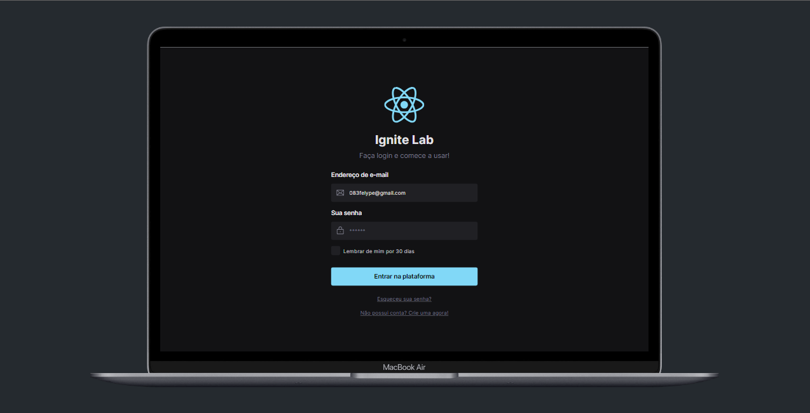
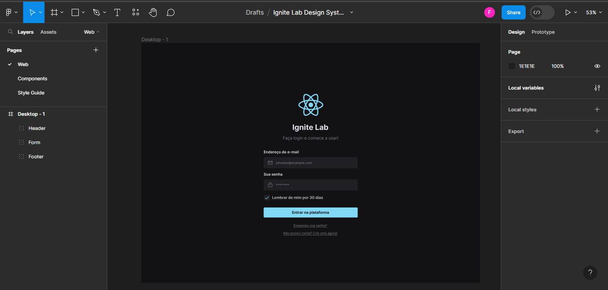
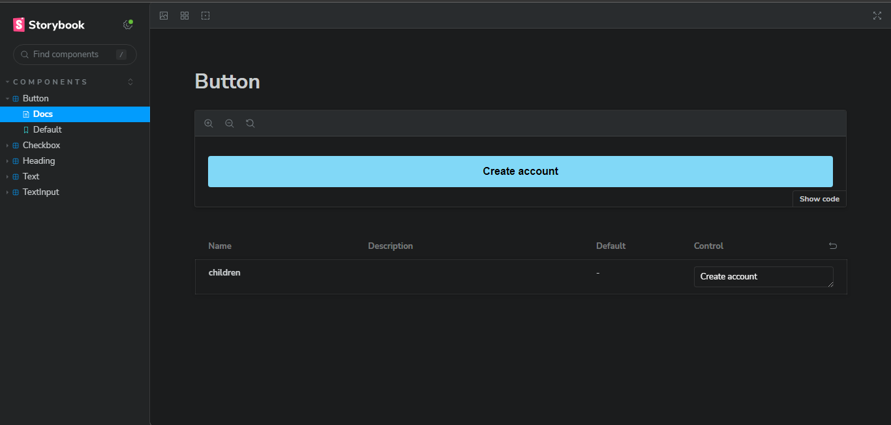

<h1 align="center">React Design System</h1>

<div align="center">
  
</div>

## 1 - Sobre

Este é um projeto desenvolvido durante o Ignite Lab Design System, que se trata de uma aplicação de Design System construída com as melhores práticas de desenvolvimento.

---

## 2 - Tecnologias

Um pouco das tecnologias que foram utilizadas no projeto:

- ReactJs
- TypeScript
- Radix UI
- Tailwind CSS
- Figma
- Storybook
- GitHub Actions (CI/CD)

---

## 3 - Layout no Figma

Para visualizar o layout do projeto no Figma, acesse o [Figma](https://www.figma.com/file/9sCzNiqmDqLvBDm6MAPHod/Ignite-Lab-Design-System?type=design&t=PrEzBwnbff2iCZ8H-6) para obter detalhes completos.

<div align="center">
  
</div>

---

## 4 - Documentação no Storybook

Para visualizar o documentação do projeto no Storybook, acesse o [Storybook](https://651d79c73b8522ab50de5cb1-mdkyhgzejp.chromatic.com/) para obter detalhes completos.

<div align="center">
  
</div>

---

## 5 - Rodando o projeto:

Você precisa ter o [Node](https://nodejs.org/en/), o [Git](https://git-scm.com/) e algum gerenciador de pacotes([NPM](https://docs.npmjs.com/downloading-and-installing-node-js-and-npm/) | [Yarn](https://classic.yarnpkg.com/lang/en/docs/install)) instalados em sua máquina.

```bash
1. Clone o repositório:
$ git clone https://github.com/felipems1/react-design-system.git

2. Acesse a pasta e instale as dependências via terminal:
$ yarn install / npm install

3. Inicie a aplicação em modo de desenvolvimento:
$ yarn dev / npm run dev

4. O servidor será aberto em http://localhost:5173
```

<p align="center">Projeto feito com ❤️ por <a href="https://www.linkedin.com/in/felipems12/">Felipe Moises</a></p>
